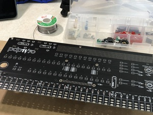
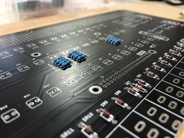
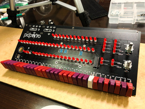
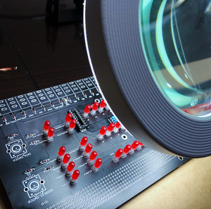
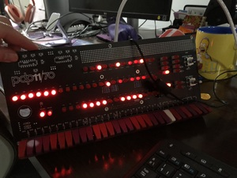
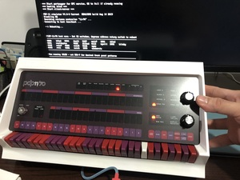

+++
title = 'Mi Aventura Recreando la Historia de la Computación con la PiDP-11'
date = 2023-03-15T11:00:00-07:00
draft = false
tags = ['programación','retro']
summary = 'Si eres fanático de la historia de la computación o simplemente te encanta construir cosas con tus propias manos, ¡este proyecto es para ti!'
+++

Mi Aventura Recreando la Historia de la Computación con la PiDP-11

¡Hola a todos! Hoy quiero compartirles una de mis experiencias más emocionantes y gratificantes en el mundo de la tecnología retro y el hardware: **ensamblar mi propia réplica de la legendaria computadora PDP-11, la PiDP-11**. Si eres fanático de la historia de la computación o simplemente te encanta construir cosas con tus propias manos, ¡este proyecto es para ti!

## ¿Qué es la PiDP-11?

Para aquellos que no la conocen, la **PDP-11** fue una serie de minicomputadoras muy influyentes, lanzadas por Digital Equipment Corporation (DEC) en los años 70. Fue fundamental en el desarrollo de sistemas operativos como UNIX y sentó muchas de las bases de la arquitectura de computadoras modernas. Es, sin duda, un ícono.

La **PiDP-11** es una **réplica a escala y completamente funcional de la consola frontal de la PDP-11**, pero con un giro moderno: en su corazón late una **Raspberry Pi**. Esto significa que puedes tener una pieza de historia de la computación en tu escritorio, con todos esos fascinantes interruptores y luces parpadeantes, ¡y además programarla!

## ¿Por qué me embarqué en este proyecto?

Como alguien apasionado por la tecnología y con interés en su evolución, la idea de no solo poseer, sino **ensamblar** una réplica de la PDP-11 era irresistible. Este proyecto combina varias de mis pasiones:

* **Historia de la Computación:** Tener la PiDP-11 es como tener una ventana tangible al pasado de la informática. Operar sus interruptores y ver sus luces te conecta directamente con cómo interactuaban los pioneros de la computación con estas máquinas.
* **Ensamblaje de Hardware:** Disfruto mucho el proceso de construir dispositivos electrónicos desde cero. La PiDP-11 es un kit que requiere soldadura y paciencia, lo cual es increíblemente gratificante una vez que ves los componentes unirse.
* **Programación Retro:** Más allá del ensamblaje, la PiDP-11 permite experimentar con sistemas operativos y programas de la época PDP-11, todo ello emulado en la Raspberry Pi. Es una oportunidad única para explorar cómo se programaba en esos tiempos.

## Mi Experiencia de Ensamblaje: Luces, Soldadura y Satisfacción

Compré el kit de la PiDP-11 y, siguiendo las **detalladas instrucciones** que se encuentran en el sitio web de obsolescence.dev, me sumergí en el proceso de construcción. Fue una experiencia increíble que puso a prueba mis habilidades de soldadura y mi atención al detalle. Cada interruptor, cada LED, fue colocado con cuidado, viendo cómo la placa poco a poco tomaba forma.

  

    

      

      

    

    

      

      

    

    

      

      

    

    

      

      

    

    

      

      

    

  

      

      

    

  

La emoción de conectar la Raspberry Pi, encender la PiDP-11 por primera vez y ver las luces parpadear, reflejando la actividad interna de una máquina virtual PDP-11, ¡fue indescriptible! Fue una mezcla de alivio y pura alegría al saber que lo había logrado.

## ¿Y ahora qué? ¡A Programar!

Haber ensamblado exitosamente mi PiDP-11 es solo la primera parte de esta aventura. Ahora, el siguiente paso es explorar el software. Ya estoy ansioso por sumergirme en los sistemas operativos y programas de la PDP-11, para experimentar de primera mano cómo se programaba en esta icónica máquina.

Si alguna vez te has sentido intrigado por la historia de la computación o te apetece un desafío de ensamblaje con una recompensa funcional y visualmente impresionante, ¡no puedo recomendar lo suficiente el proyecto PiDP-11!

¿Hay algún otro proyecto de hardware retro que les apasione o que les gustaría construir? ¡Me encantaría escuchar sus ideas en los comentarios!
